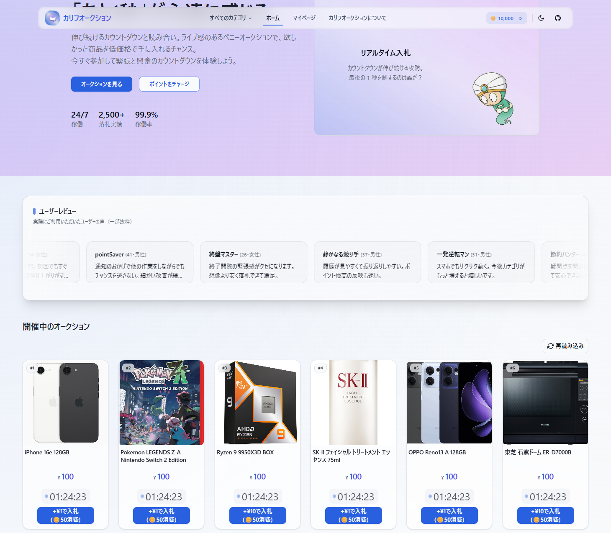

<div align="center">
   
</div>

# Caliph Auction (Frontend)

エンタメ性と透明性を併せ持つ「ペニーオークション型 (時間延長 / 最低入札単位制)」リアルタイムオークション SPA フロントエンドです。Vue 3 / TypeScript / Vite を用い、SignalR WebSocket による低レイテンシな価格更新と、ユーザ視点の公平性 (サーバ時刻同期 / 再接続復元) を重視しています。

## サイト URL

本番サイト: **https://www.caliphauction.com/**  
（デプロイ状況 / メンテナンスにより一時的にアクセスできない場合があります）

## 関連リポジトリ

| 名前                    | リンク                                                      | 役割 / 概要                       |
| ----------------------- | ----------------------------------------------------------- | --------------------------------- |
| Frontend (本リポジトリ) | https://github.com/southernwind/CaliphAuctionFront          | SPA / Vue3 / SignalR クライアント |
| Backend                 | https://github.com/southernwind/CaliphAuctionBackend        | REST API / 入札 BOT / SignalR Hub |
| Infrastructure          | https://github.com/southernwind/CaliphAuctionInfrastructure | IaC / CI/CD / 環境構築スクリプト  |

※ ライセンスはいずれも「ソース公開 (再頒布不可)」ポリシーに準拠（各 README を参照）。

## 特徴 (Features)

- 🔄 リアルタイム更新: SignalR (WebSocket) により入札/終了イベントを即時反映
- ⏱ サーバ時刻同期: RTT 補正 + 平滑化 (EMA) によるクライアント側疑似サーバ時刻 (`approxNow`)
- 🧮 オークションロジック表示: 残り時間 / 延長挙動 / 最高入札者ハイライト
- 🖼 CDN 統一: 商品画像 URL を `toCdnUrl()` で正規化 (キャッシュ効率 & 混在防止)
- 🔐 トークン付与: ローカルストレージの JWT を Axios interceptor で自動注入
- ♻️ 自動再接続: 接続断後の再接続時に可視アイテム ID を再送 (`SetVisibleItems`)
- ♿ アクセシビリティ配慮: 価格変動のアニメーション / ARIA ライブ領域調整
- 🎨 UI: Tailwind + shadcn/vue コンポーネント指向設計
- 🧪 型安全: Zod + vee-validate による入力検証 (フォーム部)

## スクリーンショット



## アーキテクチャ概要

```
┌────────────────┐      ┌────────────────────────┐
│ Vue Router     │────▶ │ ページコンポーネント     │
└───────┬────────┘      └───────┬────────────────┘
        │                       │ fetch / mutate
        │                       ▼
        │                   Axios API Client
        │                       │ REST (JSON + serverTimeUtc)
        ▼                       ▼
   Pinia Stores  ◀──────────  Time Sync (offset EMA)
        │                       ▲
        ▼                       │ events
   UI Components ◀──── SignalR Hub (BidUpdate / AuctionClosed)
```

### リアルタイム層

- `src/realtime/auctionHub.ts` が単一クライアントインスタンスを提供
- 接続確立時/再確立時: 可視アイテム集合をサーバへ `SetVisibleItems`
- イベント: `ReceiveBidUpdate`, `ReceiveAuctionClosed`
- オークション詳細では個別 `SubscribeItem` / 一覧では `setVisibleItems`

### 時刻同期

- 各レスポンスの `serverTimeUtc` と RTT/2 補正からオフセット計測
- `timeSync` ストアで指数移動平均 (alpha=0.2) 平滑化
- 残り時間表示や「終了予定」の信頼性向上

### 画像/CDN

- 商品画像は `toCdnUrl()` で正規化し混在コンテンツ/キャッシュ不一致を抑制

## ディレクトリ構成 (抜粋)

```
src/
   api/            # Axios API ラッパ (認証/日付復元/401ハンドリング)
   realtime/       # SignalR クライアント
   stores/         # Pinia (auth, timeSync, points 等)
   components/     # UI / ドメインコンポーネント
   views/          # ルーティング単位ページ
   constants/      # 定数 (例: 都道府県)
   lib/            # 汎用 util (jwt, cdn など)
public/           # そのまま配信される静的ファイル
docs/images/      # ← README 用 ※ビルド対象外
```

## セットアップ

```bash
git clone https://github.com/southernwind/CaliphAuctionFront.git
cd CaliphAuctionFront
npm ci
cp .env.development .env.local  # 必要なら上書き
npm run dev
```

デフォルトでポートは Vite 標準 (`5173` など) 。固定したい場合は `--port` オプションや `vite.config.ts` 変更。

### スクリプト

| コマンド          | 説明                          |
| ----------------- | ----------------------------- |
| `npm run dev`     | 開発サーバ (HMR)              |
| `npm run build`   | 型チェック + 本番ビルド (ESM) |
| `npm run preview` | ローカルで dist プレビュー    |

## 環境変数

| 変数                | 用途           | 備考 |
| ------------------- | -------------- | ---- |
| `VITE_API_BASE_URL` | API ベース URL | -    |

`.env.development` / `.env.production` を用意しビルドモードで自動読込。追加モード例: `vite build --mode staging` → `.env.staging`。

## 認証 / セッション

- ログイン成功時: JWT を `localStorage.auth_token` に格納
- Axios request interceptor で `Authorization: Bearer <token>` 自動付与
- 401 発生時: トークン破棄 + `/signin?redirect=元URL` へ誘導

## デプロイ

GitHub Actions (`.github/workflows/deploy.yml`) で:

1. `npm ci`
2. `npm run build`
3. `rsync` で `dist/` → サーバ ディレクトリ同期 (SPA fallback 設定必要)

必要シークレット: `DEPLOY_SSH_KEY` (パスフレーズ無し推奨)。接続先ホスト/パスはワークフロー内にハードコードされているため変更時は PR で調整。

## ライセンス

このリポジトリは「ソースコード閲覧・学習目的での公開」であり、一般的な OSS ライセンス (MIT / Apache など) ではありません。いわゆる _Source-Available_ ポリシーです。

### 許可される行為

- 個人的または社内での学習・参考・評価
- 自身の環境でのビルド・実行・検証
- 一部コード断片 (短い抜粋) を引用した技術記事等への掲載 (出典明記が条件)

### 禁止される行為 (明示的に許可しない)

- 本リポジトリ全体または実質的主要部分の再頒布 (フォークを含む公的再公開)
- コードの改変版を公衆に提供 / ホスティング / SaaS として提供
- ライセンス互換を前提とした他 OSS への組み込み
- 商用目的 (利用・販売・再販) での使用

### 追加注意

- 上記に該当しない利用 (教材化 / セミナー利用 / 研究引用 など) を希望する場合は事前に相談してください。
- いつでもライセンス/公開方針を変更・終了する可能性があります。
- Issue / PR は受け付けますが、マージ/反映は保証されません。

将来的に OSS ライセンスへ移行する場合は明示的に本節を置き換えます。それまでは本記述が優先します。

## クイック参照

| 領域                    | ファイル                                     |
| ----------------------- | -------------------------------------------- |
| API クライアント        | `src/api/client.ts`                          |
| リアルタイム Hub        | `src/realtime/auctionHub.ts`                 |
| 時刻同期ストア          | `src/stores/timeSync.ts`                     |
| オークション詳細        | `src/views/auction/AuctionDetailView.vue`    |
| 商品一覧 (リアルタイム) | `src/components/AuctionItemRealtimeGrid.vue` |

-
