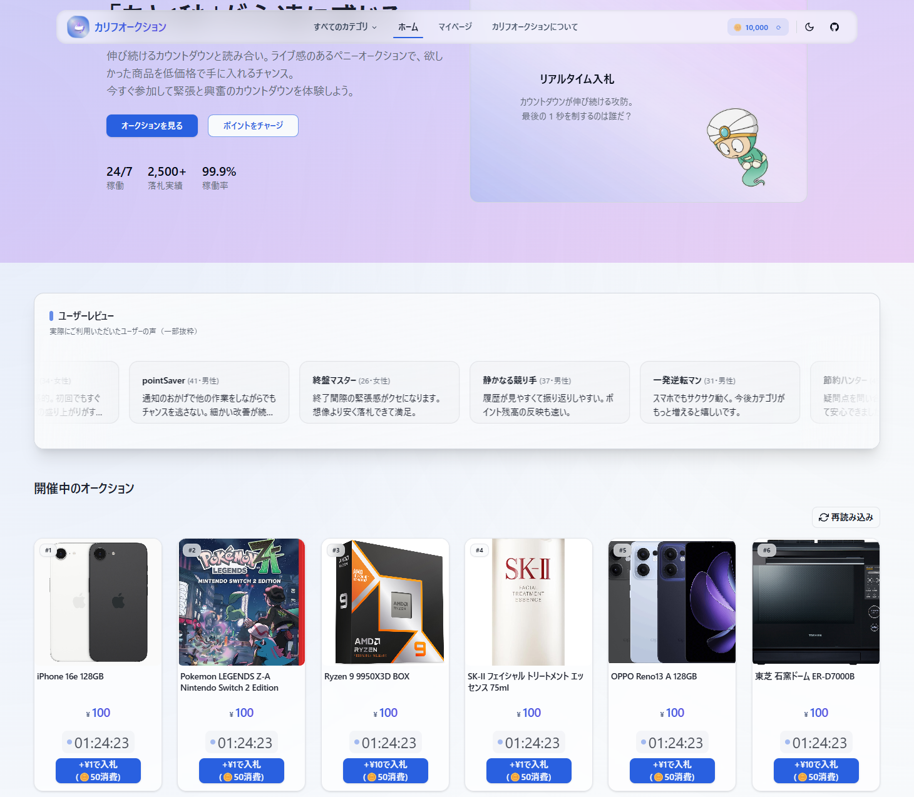

<div align="center">
   
</div>

# Caliph Auction Frontend

## 免責事項

**本プロジェクトは、過去に詐欺目的で運営されていたペニーオークションサイトの再現です。このコードベース上での実装は研究・教育目的であり、実際の金銭のやり取りは発生しません。本フロントエンドを実際の決済システムと連携させて商用利用することは禁止されています。**

---

## 概要

Vue 3 + TypeScript + Vite で構築されたシングルページアプリケーション (SPA)。ペニーオークション型のリアルタイムオークション機能を実装します。SignalR (WebSocket) による低遅延な入札更新、サーバ時刻同期メカニズム、自動再接続機能により、分散環境下での高い一貫性を目指しています。

## 関連リポジトリ

| 名前                    | リンク                                                | 役割 / 概要                       |
| ----------------------- | ----------------------------------------------------- | --------------------------------- |
| Frontend (本リポジトリ) | <https://github.com/xm-i/CaliphAuctionFront>          | SPA / Vue3 / SignalR クライアント |
| Backend                 | <https://github.com/xm-i/CaliphAuctionBackend>        | REST API / 入札 BOT / SignalR Hub |
| Infrastructure          | <https://github.com/xm-i/CaliphAuctionInfrastructure> | IaC / CI/CD / 環境構築スクリプト  |

※ ライセンスはいずれも「ソース公開 (再頒布不可)」ポリシーに準拠（各 README を参照）。

## 技術要件

| 環境     | 要件                                              |
| -------- | ------------------------------------------------- |
| Node.js  | 18+                                               |
| npm      | 9+                                                |
| ブラウザ | WebSocket 対応 (Chrome / Firefox / Safari / Edge) |

## 主要技術スタック

| 用途              | 技術                     |
| ----------------- | ------------------------ |
| フレームワーク    | Vue 3 (Composition API)  |
| 言語              | TypeScript 5+            |
| ビルドツール      | Vite 5+                  |
| 状態管理          | Pinia                    |
| リアルタイム通信  | SignalR/WebSocket        |
| HTTP クライアント | Axios                    |
| スタイリング      | Tailwind CSS 4+          |
| UI コンポーネント | shadcn/vue               |
| フォーム検証      | Zod + vee-validate       |
| ルーティング      | Vue Router 4+            |
| CDN管理           | 独自 `toCdnUrl()` ラッパ |

## 核心機能

### リアルタイム入札更新

SignalR WebSocket クライアント (`src/realtime/auctionHub.ts`) が、サーバのハブイベント `ReceiveBidUpdate` および `ReceiveAuctionClosed` をリアルタイムで受信します。接続確立時・再確立時には、現在表示中のアイテム ID 群を `SetVisibleItems` メッセージで送信し、サーバ側でブロードキャスト対象を最適化します。

### サーバ時刻同期

REST レスポンスヘッダの `serverTimeUtc` とネットワーク RTT/2 補正値を用いて、クライアント側でサーバ時刻の推定オフセットを計算します。`src/stores/timeSync.ts` の Pinia ストアが指数移動平均 (α=0.2) により平滑化し、`approxNow()` メソッドで疑似サーバ時刻を提供します。これにより、分散クライアント間での時刻判定誤差を最小化します。

### 自動再接続と状態復元

WebSocket 接続喪失時、自動再接続メカニズムが起動します。再接続後、前回表示していたアイテム ID 群を改めて `SetVisibleItems` で送信し、サーバ側からの更新配信を再開します。一時的なネットワーク断裂による表示遅延を抑制します。

### JWT トークン管理

ローカルストレージに保持される JWT をすべての HTTP リクエストに自動注入 (Axios interceptor)。401 レスポンス時の自動更新リトライ、トークン失効時のログアウト処理を実装しています。

### 画像 CDN 統一

商品画像 URL は `src/lib/cdn.ts` の `toCdnUrl()` 関数で正規化されます。混在コンテンツ警告排除、キャッシュキー一貫性、CDN 配信元の統一を実現します。

### フォーム入力検証

支払方法選択、住所入力、ポイントチャージなどのフォーム要素は Zod スキーマ定義と vee-validate で型安全に検証されます。

## スクリーンショット



## アーキテクチャ

### データフロー

```
Vue Router (src/router/index.ts)
    ↓
ページコンポーネント (src/views/)
    ↓
API レイヤー (src/api/)
    ├─ Axios インスタンス (jwt, 401 ハンドリング)
    └─ サーバレスポンス (JSON + serverTimeUtc ヘッダ)
    ↓
Pinia ストア (src/stores/)
    ├─ auth.ts           (認証状態、ユーザ情報)
    ├─ timeSync.ts       (オフセット EMA 平滑化)
    ├─ pointsBalance.ts  (ポイント残高)
    ├─ notifications.ts  (トースト通知)
    └─ pointsPurchase.ts (ポイントチャージ状態)
    ↓
UI コンポーネント (src/components/)
    ├─ ドメイン固有 (AuctionItemCard.vue, PlaceBidButton.vue 等)
    └─ 汎用 UI (src/components/ui/)
```

### リアルタイム層

- **接続管理**: `src/realtime/auctionHub.ts` は HubConnection のシングルトン化により、アプリケーション全体で単一の SignalR 接続を保持
- **メッセージング**
  - Outbound: `SetVisibleItems(itemIds: number[])`, `SubscribeItem(itemId: number)`
  - Inbound: `ReceiveBidUpdate(auction)`, `ReceiveAuctionClosed(auction)`
- **再接続ロジック**: 接続喪失後 3 秒以内に自動再接続試行、成功時に前回の可視アイテム ID を再送
- **動的購読**: 詳細ページ遷移時は該当アイテムのみ購読、一覧表示時は viewport 内アイテムを動的管理

### HTTP API インターセプタ

`src/api/client.ts` で設定される Axios インターセプタは以下を実装:

- リクエスト: ローカルストレージの JWT を `Authorization: Bearer <token>` に注入
- レスポンス: すべてのレスポンスから `serverTimeUtc` を抽出、`timeSync` ストアへ送信
- エラーハンドリ: 401 は自動更新リトライ、403/5xx は `GlobalErrorToasts` コンポーネントへディスパッチ

### ファイル構成

```
src/
  api/                 # HTTP クライアント層
    auth.ts            # ログイン/サインアップ API
    auction.ts         # オークション一覧・詳細 API
    client.ts          # Axios インスタンス (JWT インジェクション, インターセプタ)
    me.ts              # ユーザ情報 API
    points.ts          # ポイント残高取得 API
    purchases.ts       # 購入履歴 API

  realtime/            # SignalR クライアント
    auctionHub.ts      # HubConnection シングルトン管理

  stores/              # Pinia ストア
    auth.ts            # 認証状態 (JWT, currentUser, isLoggedIn)
    timeSync.ts        # オフセット同期 (approxNow())
    points*.ts         # ポイント関連状態
    notifications.ts   # グローバル通知

  views/               # ルーティング対象ページコンポーネント
    auction/           # オークション詳細・購入フロー
    home/              # ホーム / オークション一覧
    signin/signup/     # 認証フロー
    mypage/            # ユーザダッシュボード
    points/            # ポイントチャージ
    about/             # 静的情報ページ

  components/          # Vue コンポーネント
    ui/                # shadcn/vue プリミティブ (Button, Card, Dialog 等)
    **/                # 機能別サブコンポーネント
    AuctionItemCard.vue        # オークション商品カード
    AuctionItemRealtimeGrid.vue # リアルタイムグリッド
    PlaceBidButton.vue         # 入札ボタン (状態遷移)
    CountdownTimer.vue         # 残り時間カウントダウン
    ConnectionStatusOverlay.vue # 接続状態インジケータ

  composables/         # Vue 3 Composition 再利用ロジック
    useAuth.ts         # 認証操作 (ログイン, ログアウト)
    useHeader.ts       # ヘッダ UI 状態
    usePageTitle.ts    # ページタイトル動的設定

  lib/                 # 汎用ユーティリティ
    cdn.ts             # toCdnUrl() 関数 (CDN URL 正規化)
    jwt.ts             # JWT デコード / 有効性確認
    utils.ts           # 日付フォーマット等

  types/               # TypeScript 型定義
    auction-item.ts    # オークション商品インタフェース

  constants/           # 定数定義
    prefectures.ts     # 都道府県リスト
    mascotImages.ts    # マスコット画像マッピング

  router/
    index.ts           # Vue Router 設定 (ルート定義)

  assets/
    index.css          # グローバルスタイル

public/               # そのまま配信される静的ファイル
docs/images/          # README/ドキュメント用画像
```

## セットアップ手順

### 1. 依存パッケージのインストール

```bash
git clone https://github.com/xm-i/CaliphAuctionFront.git
cd CaliphAuctionFront
npm ci
```

### 2. 環境変数の設定

開発環境向け `.env.local` を作成してください。テンプレート:

```
VITE_API_BASE_URL=http://localhost:5000
VITE_SIGNALR_HUB_URL=http://localhost:5000/auction-hub
```

### 3. 開発サーバの起動

```bash
npm run dev
```

デフォルトでは `http://localhost:5173` で起動します。ポート固定が必要な場合は `--port` オプションを使用:

```bash
npm run dev -- --port 3000

```

### 4. ビルド

本番向けビルド:

```bash
npm run build
```

出力ディレクトリ: `dist/`

### 5. プレビュー

ビルド出力をローカルプレビュー:

```bash
npm run preview
```

## NPM スクリプト

| コマンド             | 説明                                |
| -------------------- | ----------------------------------- |
| `npm run dev`        | 開発サーバ起動 (ホットリロード有効) |
| `npm run build`      | 本番向けビルド (dist/ 出力)         |
| `npm run preview`    | ビルド出力のローカルプレビュー      |
| `npm run type-check` | TypeScript 型チェック               |
| `npm run lint`       | ESLint + Prettier チェック          |

## 開発ガイドライン

### コンポーネント設計

- Vue 3 Composition API を使用
- `<script setup>` シンタックスを推奨
- 小さな再利用可能なコンポーネントに分割
- shadcn/vue を UI プリミティブとして活用

### 状態管理

- グローバル状態: Pinia ストア (`src/stores/`)
- ローカル状態: `ref` / `reactive` (Composition API)
- フォーム状態: vee-validate + Zod スキーマ

### 非同期データ処理

- HTTP リクエスト: `src/api/` 経由の Axios
- レスポンスヘッダからの `serverTimeUtc` 抽出は自動 (インターセプタ)
- リアルタイムイベント: `src/realtime/auctionHub.ts` 経由

### 時刻操作

- 絶対的な現在時刻が必要な場合: `timeSync` ストアの `approxNow()` を使用
- クライアント時刻は使用しない (サーバ時刻と乖離の可能性)

### TypeScript 型安全性

- フォーム入力: Zod スキーマで定義し vee-validate で検証
- API レスポンス: インタフェース定義 (`src/types/`) で型付け
- コンポーネント Props: `withDefaults(defineProps<T>())` で明示

## 関連リポジトリの確認

本フロントエンドは以下と密に連携しています:

- **Backend**: REST API エンドポイント定義、SignalR Hub メッセージ仕様の確認
- **Infrastructure**: デプロイ環境設定、環境変数、CDN URL スキーム

各リポジトリの README を必ず確認してください。

## 問題報告・機能リクエスト

本リポジトリは教育・研究目的のため、セキュリティまたは重大バグ報告以外のイシューは受け付けていません。

## ライセンス

ソース公開 (再頒布不可) ポリシーに準拠。詳細は各リポジトリの LICENSE を参照してください。

### スクリプト

| コマンド          | 説明                          |
| ----------------- | ----------------------------- |
| `npm run dev`     | 開発サーバ (HMR)              |
| `npm run build`   | 型チェック + 本番ビルド (ESM) |
| `npm run preview` | ローカルで dist プレビュー    |

## 環境変数

| 変数                | 用途           | 備考 |
| ------------------- | -------------- | ---- |
| `VITE_API_BASE_URL` | API ベース URL | -    |

`.env.development` / `.env.production` を用意しビルドモードで自動読込。追加モード例: `vite build --mode staging` → `.env.staging`。

## 認証 / セッション

- ログイン成功時: JWT を `localStorage.auth_token` に格納
- Axios request interceptor で `Authorization: Bearer <token>` 自動付与
- 401 発生時: トークン破棄 + `/signin?redirect=元URL` へ誘導

## デプロイ

GitHub Actions (`.github/workflows/deploy.yml`) で:

1. `npm ci`
2. `npm run build`
3. `rsync` で `dist/` → サーバ ディレクトリ同期 (SPA fallback 設定必要)

必要シークレット: `DEPLOY_SSH_KEY` (パスフレーズ無し推奨)。接続先ホスト/パスはワークフロー内にハードコードされているため変更時は PR で調整。

## ライセンス

このリポジトリは「ソースコード閲覧・学習目的での公開」であり、一般的な OSS ライセンス (MIT / Apache など) ではありません。いわゆる _Source-Available_ ポリシーです。

### 許可される行為

- 個人的または社内での学習・参考・評価
- 自身の環境でのビルド・実行・検証
- 一部コード断片 (短い抜粋) を引用した技術記事等への掲載 (出典明記が条件)

### 禁止される行為 (明示的に許可しない)

- 本リポジトリ全体または実質的主要部分の再頒布 (フォークを含む公的再公開)
- コードの改変版を公衆に提供 / ホスティング / SaaS として提供
- ライセンス互換を前提とした他 OSS への組み込み
- 商用目的 (利用・販売・再販) での使用

### 追加注意

- 上記に該当しない利用 (教材化 / セミナー利用 / 研究引用 など) を希望する場合は事前に相談してください。
- いつでもライセンス/公開方針を変更・終了する可能性があります。
- Issue / PR は受け付けますが、マージ/反映は保証されません。

将来的に OSS ライセンスへ移行する場合は明示的に本節を置き換えます。それまでは本記述が優先します。

## クイック参照

| 領域                    | ファイル                                     |
| ----------------------- | -------------------------------------------- |
| API クライアント        | `src/api/client.ts`                          |
| リアルタイム Hub        | `src/realtime/auctionHub.ts`                 |
| 時刻同期ストア          | `src/stores/timeSync.ts`                     |
| オークション詳細        | `src/views/auction/AuctionDetailView.vue`    |
| 商品一覧 (リアルタイム) | `src/components/AuctionItemRealtimeGrid.vue` |

-
